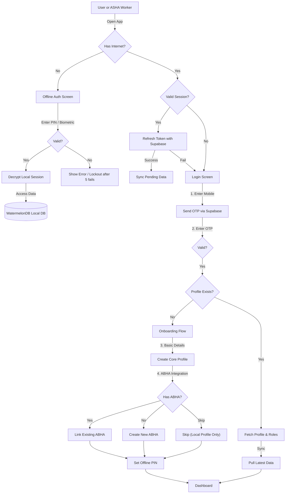

# Rural Healthcare Platform - Master Logic & Architecture Blueprint

> [!IMPORTANT]
> This document acts as the **Single Source of Truth** for the entire project. It consolidates Authentication, System Architecture, Feature Specifications, and ABDM Integration strategies.

---

# Part 1: Authentication & Identity Strategy

## Goal
Establish a secure, offline-first authentication system that supports rural users (often sharing devices) and healthcare workers, while fully integrating with the Ayushman Bharat Digital Mission (ABDM) via ABHA ID.

## Core Identity Provider: Supabase Auth
We will use **Supabase Auth** as the primary identity provider because it offers:
1.  **Native Phone/OTP Support:** Critical for rural India usage.
2.  **JWT Based Sessions:** Stateless, perfect for mobile apps and syncing.
3.  **Row Level Security (RLS):** Policies are enforced at the database level, ensuring data safety even if the API layer has bugs.

---

## User Types & Roles
We will use **Custom Claims** in the JWT (JSON Web Token) to distinguish roles.

| Role | Description | Authentication Method |
| :--- | :--- | :--- |
| **Citizen (Beneficiary)** | Rural resident needing care. | **Phone OTP** (Primary)   **ABHA Login** (Secondary/Optional) |
| **Sahayak (ASHA Worker)** | Health worker managing multiple families. | **Phone OTP + Admin Approval** (Strict verification — see below) |
| **Admin/Doctor** | Monitoring dashboard access. | **Email/Password + 2FA** |

### Sahayak Verification Process
Registration as a Sahayak requires admin approval to prevent impersonation:
1.  **Submit:** Sahayak enters Govt-issued **ASHA ID number**, uploads a **selfie**, and selects **district assignment**.
2.  **Review:** Admin (via Web Portal) cross-verifies against PHC (Primary Health Centre) records.
3.  **Status Flow:** `Pending` → `Verified` → `Active`.
4.  **Restriction:** Unverified Sahayaks can only access their *own* profile. They **cannot** create sub-profiles or access patient data until status = `Active`.

---

## Technical Strategy

### 1. Registration Flow (The "Onboarding" Phase)
*   **Step 1:** User enters Mobile Number.
*   **Step 2:** Supabase sends OTP via SMS provider (e.g., Twilio/Fast2SMS).
*   **Step 3:** User verifies OTP -> Supabase creates a User ID (UUID).
*   **Step 4 (Profile Creation):** User enters Name, Age, Gender, Language Preference.
*   **Step 5 (ABHA Integration):**
    *   *Option A:* User has ABHA -> Enter ABHA Address -> Validate via OTP -> Link to Supabase Profile.
    *   *Option B:* User does NOT have ABHA -> Create ABHA via our app (calls ABDM Sandbox API) -> Link to Supabase Profile.
    *   *Option C:* Skip for now (local profile only).

### 2. Login Flow (Session Management)
*   **Online:** Standard Supabase `signInWithOtp()`. Returns Access Token (1 hour) and Refresh Token (long-lived).
*   **OTP Rate Limiting:**
    *   Max **3 OTP requests** per phone number per 10 minutes.
    *   Max **5 OTP verification attempts** per session (then block for 15 min).
    *   Exponential backoff on consecutive failures.
    *   Alert admin on suspicious patterns (>10 requests/hour from same IP).
*   **Device Registry:** On each successful login, register the device in `public.devices` table:
    *   Schema: `device_id (UUID)`, `user_id`, `device_name`, `device_fingerprint`, `last_active`, `is_revoked`.
    *   Refresh tokens are **bound to the device fingerprint** — a token cannot be used from a different device.
    *   Users can view active sessions and **revoke any device** from the app or web portal.
    *   Admin can **force-revoke all sessions** for a user.
*   **Offline / Low Connectivity:**
    *   The app will cache the `Refresh Token` securely (Encrypted Storage on Mobile).
    *   **App Lock:** Users set a **6-digit PIN** (minimum) or use **Biometrics** (recommended primary method) to open the app locally without needing a network call.
    *   **PIN Lockout Policy:** After 5 failed PIN attempts, progressive lockout (30s → 1m → 5m → 15m). After 10 consecutive failures, the local encrypted DB is wiped and full re-authentication is required.
    *   *Note:* Critical actions (like syncing PHR data) will require bringing the app Online and re-verifying if the token is expired.

### 2a. Logout & Session Management
*   **Logout:** Clears local tokens, removes encryption key from memory, and optionally wipes local DB (user prompted).
*   **Forced Logout:** Admin can trigger remote session revocation via the device registry.
*   **Concurrent Sessions:** Max **2 active devices** per user. Login on a 3rd device prompts the user to revoke the oldest session.
*   **Shared Device Handling:** Sahayak mode auto-locks after **5 minutes of inactivity**, requiring re-authentication (PIN/Biometric) to resume.

### 2b. Account Recovery
*   **Phone Lost / Device Stolen:**
    1.  User logs in on a new device via **Phone OTP** (standard flow).
    2.  Server-side data (Supabase) is intact and synced to the new device.
    3.  **Local-only data** (unsynced changes) on the lost device is **irrecoverable** — user is warned of this during onboarding.
    4.  If ABHA is linked, health records can be re-fetched from ABDM.
*   **Optional Cloud Backup:** User can opt-in to **encrypted cloud backup** of local DB (stored in Supabase Storage, encrypted with user's key). This mitigates data loss on device failure.
*   **Remote Wipe:** User (or admin) can mark the lost device as revoked via the device registry, invalidating its refresh token.

### 2c. Device Management
*   **Active Devices:** Users can view all registered devices in Settings (device name, last active, location).
*   **Transfer to New Device:** Login on new device → OTP verify → pull data from Supabase → old device auto-deactivated after 24 hours.
*   **Revoke Device:** Instantly invalidates refresh token for target device. Next app launch on that device forces full re-login.

### 3. Sahayak Mode (Multi-Profile Management)
ASHA workers often use *their* device to help others.
*   **Agent Login:** The Sahayak logs in with her credentials.
*   **Family/Patient Profiles:** She creates "sub-profiles" for villagers under her ID.
*   **Consent:** When accessing a specific patient's records, if that patient has their own ABHA linked, the Sahayak initiates a **Consent Request** which sends an OTP to the *patient's* phone.
    *   **Secure OTP Entry:** The patient enters the OTP **directly on the Sahayak's device** (not shared verbally) to prevent interception.
    *   **Assisted Mode:** If the patient is illiterate, the Sahayak reads the OTP aloud but the patient must tap a **"Confirm" button** on screen to authorize.
    *   **Time-Limited Session:** Consent grants a **15-minute access window** that auto-expires. Re-consent required for continued access.
*   **Sub-Profile Ownership Transfer:**
    *   When a villager later registers independently (own phone + ABHA), the system detects a matching ABHA address or phone number.
    *   Prompt: *"We found existing records created by Sahayak X. Merge into your profile?"*
    *   On confirmation: all records transfer to the villager's own account. The Sahayak loses direct access and must re-request consent to view.

### 4. App Attestation (API Abuse Prevention)
All API calls to Supabase and ABDM must include a device attestation token to verify requests originate from the genuine app.
*   **Android:** Google **Play Integrity API**.
*   **iOS:** Apple **App Attest**.
*   **Policy:** Fail-open during development/sandbox testing. **Fail-closed in production** — unauthenticated clients are rejected.
*   **Purpose:** Prevents spoofed clients from abusing OTP endpoints, ABDM APIs, or scraping patient data.

---

## Master Authentication Flow (Mermaid Map)

## Detailed Integration Flows

### A. Registration & ABHA Linking
This flow ensures every user is verified and optionally linked to the National Health Stack.

| Step | User Action | System Action (Backend/API) |
| :--- | :--- | :--- |
| **1. Mobile Entry** | Enters `+91-9876543210` | `supabase.auth.signInWithOtp({ phone: '+91...' })` |
| **2. Verification** | Enters `123456` | `supabase.auth.verifyOtp(...)` -> Returns `session` (JWT) |
| **3. Profile Check** | (Auto) | Query `public.users` table for `id = auth.uid()`. If null -> **Go to Onboarding**. |
| **4. Details** | Name, Age, Gender | Insert into `public.users`. |
| **5. ABHA Check** | "Do you have ABHA?" | UI Prompt. |
| **6. Link ABHA** | Enters ABHA Address | Call ABDM `search/searchByHealthId` (verify current API version in ABDM Sandbox docs). |
| **7. Auth Init** | Selects Auth Mode (OTP) | Call ABDM `auth/init` (verify current API version). User gets ABHA OTP. |
| **8. Confirm** | Enters ABHA OTP | Call ABDM `auth/confirm` (verify current API version) -> Get `X-Token` -> Fetch KYC. |
| **9. Save** | (Auto) | Update `public.users` with `abha_address`, `health_id`, `kyc_status`. |

### B. Sahayak (ASHA) Mode
Authorized health workers operate differently. They manage *other people's* data.

### C. Offline Access Strategy (The "Local Lock")
Since tokens can expire, we need a robust local mechanism for field access.

1.  **Key Derivation:** On first login, the user sets a **6-digit PIN**. The encryption key is derived using **Argon2id** KDF:
    *   `AES-256 Key = Argon2id(PIN + device-specific salt)`
    *   The **salt** is generated randomly and stored in the device's secure enclave (Keychain/Keystore).
    *   The PIN itself is **never stored** — only the derived key can unlock the DB.
2.  **Storage:** The derived key is held in the secure enclave, protected by PIN or Biometric gate.
3.  **Database:** The `WatermelonDB` (SQLite) file is encrypted using this AES-256 key.
4.  **Access:**
    *   **App Launch (Offline):** User enters PIN (or Biometric) -> Derive Key via Argon2id -> Unlock DB.
    *   **No Network Call:** We accept the PIN locally.
    *   **Sync:** When network returns, we use the stored *Refresh Token* to get a valid Supabase Session and sync changes.
5.  **Key Rotation:** When the user changes their PIN:
    *   Decrypt DB with old key -> Re-encrypt with new key derived from new PIN.
    *   Old key is securely wiped from memory.
6.  **Compromise Recovery:** If the secure enclave is suspected compromised, force full online re-authentication and generate a new key + salt.

---

# Part 2: Full Project System Architecture

## High-Level System Architecture (Mermaid Map)

## Core Modules & Data Flow

### A. The "Offline-First" Engine (Mobile)
The heart of rural reliability. It allows the app to function 100% without internet.
*   **Local Database (WatermelonDB):** Stores Users, Medicine List (partial), and Cached Protocol Rules.
*   **Red Flag Engine (Logic):** A JSON-Logic based rule engine running *on the device*.
    *   *Input:* "Chest Pain" + "Sweating"
    *   *Rule:* If `symptom.severity > high` -> `Trigger Emergency`.
    *   *Output:* Show Hospital Map (cached vector data).

### B. Sync Protocol (The "Bridge")
*   **Push:** When internet is available, Mobile App pushes "Pending Changes" (new patients, health logs) to Supabase.
*   **Pull:** App pulls "Updates" (new medicine prices, doctor remarks) from Supabase.
*   **Conflict Resolution (Split Strategy):**
    *   **Medical Records** (vitals, prescriptions, diagnoses): **Append-only**. Conflicts create both versions, flagged for manual review by a doctor/admin. Medical data is never silently overwritten.
    *   **Non-medical metadata** (name, language preference, UI settings): **Last Write Wins** is acceptable.
*   **Infrastructure Resilience:**
    *   Supabase: Enable **Point-in-Time Recovery (PITR)** and **daily automated backups**.
    *   Multi-region replication is not required at MVP but noted as a Phase 5 consideration.
    *   Local DB: Unsynced data loss is an accepted trade-off of offline-first architecture. Users are warned in the UI during onboarding.

### C. AI & Multilingual Service (Python/FastAPI)
Some tasks are too heavy for basic phones or require specialized libraries.
*   **Voice-to-Text:** Receives Audio Blob -> Returns standard English medical terms (mapped to SNOMED CT codes if possible).
*   **Prescription OCR:** Upload Image -> Extract Medicine Names -> Verify against Database.
*   **Chatbot:** LLM RAG (Retrieval Augmented Generation) context-aware responses based on medical guidelines.

### D. ABDM Integration (The "Official" Layer)
*   **Prerequisite:** The platform must register as a **Health Information User (HIU)** with ABDM to fetch health records. This requires:
    *   ABDM Sandbox registration → compliance review → production approval.
    *   **Timeline:** Budget **4-6 weeks** for the approval process.
*   **ABHA Link:** Authenticates user identity.
*   **PHR Sync:** Fetches past history (with consent) to populate the timeline.
*   **Consent Artifact Lifecycle** (full ABDM consent flow, not just OTP):
    1.  **Request:** App creates a consent artifact specifying purpose, data types, and expiry duration.
    2.  **Grant:** Patient approves via OTP or biometric verification.
    3.  **Fetch:** Health data is pulled from linked facilities within the consent window.
    4.  **Expiry:** Consent auto-expires per the artifact terms (e.g., 24 hours, 30 days).
    5.  **Revoke:** Patient can revoke consent at any time from their profile. Revocation immediately blocks further data access.
*   **Scan & Share:** Generates a QR token for instant OPD registration at hospitals.

> **Note:** ABDM API endpoint versions (e.g., `v1/search/searchByHealthId`) referenced in this document should be verified against the **current ABDM Sandbox documentation** before implementation, as ABDM iterates on API versions regularly.

### D1. Audit Logging (Healthcare Compliance)
All data access events are logged to an **immutable** `public.audit_log` table:
*   **Schema:** `log_id (UUID)`, `user_id`, `action`, `target_record`, `timestamp`, `device_id`, `ip_address`.
*   **Immutability:** Insert-only — no `UPDATE` or `DELETE` permissions granted on this table, enforced via RLS.
*   **Events Logged:** Patient record access, ABHA data fetch, consent grant/revoke, login/logout, profile creation, data export.
*   **Retention:** Minimum **3 years** (aligned with Indian healthcare record-keeping requirements).
*   **Access:** Admins can query audit logs via the Web Portal. Patients can request an export of their own access logs.

### D2. Data Deletion (DPDP Act Compliance)
India's Digital Personal Data Protection Act (2023) requires the right to data erasure:
*   **User-Initiated:** User requests deletion from Settings → **30-day grace period** (allows recovery if accidental) → permanent deletion from Supabase.
*   **ABDM Unlinking:** On deletion, request ABDM record unlinking so the platform no longer appears as a linked HIU.
*   **Sahayak-Created Profiles:** If a Sahayak created the profile, they are notified, but deletion still proceeds — the patient's right supersedes.
*   **Audit Trail:** The deletion event itself is logged (without PII) for compliance records.
*   **Local Data:** User is prompted to wipe local DB on-device. If the device is lost, the encrypted DB remains inaccessible without the PIN.

### E. Source of Medical Data (Where does it come from?)
The platform aggregates data from **4 key sources** to build a complete patient profile:

1.  **ABDM Network (External History):**
    *   **Source:** Linked Hospitals, Labs, and Clinics via ABHA.
    *   **Data:** Discharge summaries, Prescriptions, Diagnostic Reports, Immunization Records.
    *   **Mechanism:** We request consent -> User approves -> Data is fetched via HIE-CM (Health Information Exchange).

2.  **Field Vitals (Sahayak Input):**
    *   **Source:** ASHA workers using the app during home visits.
    *   **Data:** Blood Pressure, Blood Sugar, SpO2, Height/Weight (BMI), Pregnancy status.
    *   **Mechanism:** Manual entry in "Sahayak Mode", synced when online.

3.  **Self-Reported (User Input):**
    *   **Source:** The patient via the Mobile App.
    *   **Data:** Current symptoms (Voice/Text), Allergies, Chronic Conditions (Diabetes/Hypertension), Family History.
    *   **Mechanism:** stored in `public.medical_history` table.

4.  **Static Knowledge Base (The "Brain"):**
    *   **Source:** Pre-seeded medical protocols (WHO/ICMR guidelines).
    *   **Data:**
        *   **Medicine Database:** Dosage, Side-effects, Interactions (Offline SQLite).
        *   **Triage Rules:** Symptom-to-Severity mapping (JSON Logic).
    *   **Mechanism:** Updates are pushed via "Code Push" or Delta Syncs.

### F. Medicine Database Sources (The "Formulary")
We do not "guess" medicines. The app selects from a strict, pre-approved database (approx. 2,000 common salts/brands) baked into the app for offline use.

1.  **National List of Essential Medicines (NLEM):**
    *   **Source:** Official government list (CDSCO).
    *   **Purpose:** Ensures AI *only* recommends approved, safe, essential drugs.
    *   **Mechanism:** Converted from PDF/Excel to JSON/SQL and shipped with the app.

2.  **Jan Aushadhi Product List (PMBJP):**
    *   **Source:** PMBJP public API / Excel sheet.
    *   **Purpose:** Provides exact **Price** and **Generic Name** to show cost savings (e.g., "Save ₹100").
    *   **Mechanism:** Periodic sync to update prices.

3.  **Metadata Enrichment (1MG/Pharmeasy/Open Data):**
    *   **Source:** Publicly available medical data.
    *   **Purpose:** Enriches the database with "Common Side Effects", "Hindi Descriptions", and "Storage Instructions" if government lists are missing them.

---

# Part 3: Feature Specifications (Detailed)

## 1. ABDM & User Management
- **ABHA ID:** Integrate ABDM Sandbox APIs for creation, linking, and authentication.
- **Profiles:** Family profile management with role-based access (User vs. Sahayak).
- **Sahayak Mode:** ASHA workers can "act as" patients to help them book appointments or check symptoms.

## 2. AI Multilingual Input & Symptom Checker
- **Voice Input:** Use **Bhashini API** (Govt of India favor) or OpenAI Whisper for converting Hindi/Tamil speech to text.
- **Symptom Logic:**
    - **Cloud:** LLM-based questioning for complex cases.
    - **Offline:** Strict, deterministic `json-logic` rules for emergencies (e.g., Heart Attack signs).

## 3. Healthcare Services (Offline-First)
- **Medicine Authenticity:**
    - App scans Medicine QR Code.
    - Checks batch number against a pre-downloaded "Trusted Batch List" (or API if online).
    - Shows generic alternatives with lower prices (Jan Aushadhi integration).
- **Emergency Mode:**
    - Pre-caches hospital locations for user's district.
    - Shows "Nearest Help" and "Call Ambulance" even in Airplane Mode.

## 4. Health Tools
- **Scan & Share:** Generates a QR code on the patient's phone that hospital receptionists can scan to instantly get demographic details (ABDM standard).
- **Diagnostic Booking:** Simple aggregation of nearby labs.
- **Breast Cancer Screening:** Seamless redirection to partner website (e.g., *Niramai* or specific project portal) based on risk factors flagged during EHR creation. The Mobile App will feature a "Click-to-Redirect" button for immediate access.

---

# Part 4: Technology Stack Mapping

| Layer | Component | Technology Choice | Why? |
| :--- | :--- | :--- | :--- |
| **Mobile** | App Framework | **React Native (Expo)** | Cross-platform, easy OTA updates. |
| | Local DB | **WatermelonDB** | High performance, fully observable. |
| | UI Library | **NativeWind** | Tailwind CSS for React Native — simpler API, strong community support. |
| **Web** | Dashboard | **Next.js (App Router)** | Server-Side Rendering (SSR) for admin performance. |
| **Backend** | Platform | **Supabase** | Auth, DB, Realtime, Storage out-of-the-box. |
| | Lightweight Logic | **Edge Functions** | OTP dispatch, webhook handlers, RLS helpers, push notifications. |
| | Heavy Compute | **FastAPI (Python)** | AI inference (voice-to-text, OCR, chatbot), batch processing, ABDM API proxy. |
| **Maps** | Offline | **Mapbox GL** (service) + **OpenStreetMap** (tile data) | Mapbox renders offline vector tiles sourced from OSM data. |

---

# Part 5: Development Roadmap

### Phase 1: The "Skeleton"
*   Setup Monorepo.
*   Configure Supabase & Authentication.
*   Build basic Login & Dashboard UI.
*   **Goal:** User can log in and see a blank dashboard.

### Phase 2: The "Offline Core"
*   Implement WatermelonDB schema.
*   Build Sync Adapter.
*   Create "Add Patient" form (Offline capable).
*   **Goal:** Add patient in Airplane mode -> Turn internet on -> Patient appears in Web Dashboard.

### Phase 3: The "Symptom Engine"
*   Implement `json-logic` rules engine.
*   Load basic medical protocol JSON.
*   Build Chat Interface (Mocked AI).
*   **Goal:** Selecting "High Fever" triggers a standard advice UI.

### Phase 4: ABDM & "Real" AI
*   Connect Python Service.
*   Integrate ABHA Sandbox.
*   Implement Voice Input.
*   **Goal:** Full feature set operational.
